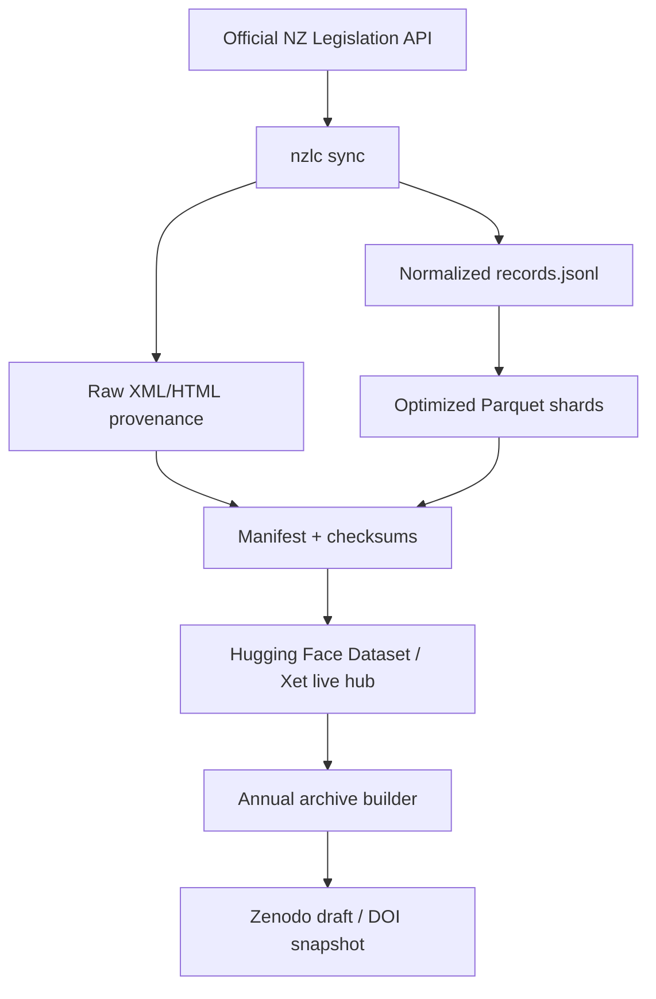

# NZ Legislation Corpus Pipeline

Low-maintenance, API-first pipeline for an evolving New Zealand legislation corpus.



## Design goals

- Keep GitHub code-only: workflows, source, tests, docs, schemas, and tiny fixtures.
- Keep the live corpus on Hugging Face Datasets, using Xet-aware uploads.
- Store user-facing data as stable, partitioned Parquet plus provenance files.
- Avoid upload churn by preserving unchanged records and comparing `content_sha256`.
- Keep Zenodo annual snapshots draft-only unless explicitly published.
- Make all workflows idempotent and safe to rerun.

## Fresh GitHub repository bootstrap

This project should be pushed to a new repository. After installing and authenticating the GitHub CLI:

```bash
gh auth login

export REPO_OWNER=edithatogo
export REPO_NAME=nz-legislation-corpus-pipeline
export REPO_VISIBILITY=public
export HF_REPO_ID=edithatogo/nz-legislation-corpus
export ARCHIVE_CREATORS_JSON='[{"name":"Your Name","affiliation":"Your Institution"}]'

# Optional but recommended before first push; skipped if unset.
export NZ_LEGISLATION_API_KEY='...'
export HF_TOKEN='...'
export ZENODO_TOKEN='...'

./scripts/bootstrap_github.sh --owner "$REPO_OWNER" --repo "$REPO_NAME" --public --protect-production
```

Aliases are provided for older docs:

```bash
./scripts/bootstrap_github_repo.sh --owner edithatogo --repo nz-legislation-corpus-pipeline --public
./scripts/setup_github_repo.sh --owner edithatogo --repo nz-legislation-corpus-pipeline --public
```

The bootstrap script creates or updates the fresh repository, pushes this code, sets GitHub Actions variables, sets secrets from environment variables, and creates `zenodo-sandbox` and `zenodo-production` environments.

See `docs/GITHUB_SETUP.md` and `docs/github_setup.md`.

## Hugging Face dataset repo

Create or confirm the live dataset repository:

```bash
HF_TOKEN='...' ./scripts/create_huggingface_dataset_repo.sh edithatogo/nz-legislation-corpus
```

## Required GitHub Actions secrets

```text
NZ_LEGISLATION_API_KEY
HF_TOKEN
ZENODO_TOKEN
ZENODO_SANDBOX_TOKEN  # optional; use when sandbox and production Zenodo tokens differ
```

## Core repository variables

```text
HF_REPO_ID
DATA_DIR
NZLC_SEARCH_TERMS
NZLC_SEARCH_FIELD
NZLC_SEARCH_SORT_BY
NZLC_LEGISLATION_TYPES
ARCHIVE_TITLE
ARCHIVE_CREATORS_JSON
ARCHIVE_LICENSE
ARCHIVE_PUBLISH
ZENODO_API_URL
ZENODO_SANDBOX_API_URL
ZENODO_DEPOSITION_ID   # optional after first production Zenodo record
```

## Local install

```bash
uv sync --extra dev --frozen
uv run nzlc doctor
```

## Local no-network smoke test

```bash
./scripts/first_run_local.sh
```

Or manually:

```bash
ARCHIVE_CREATORS_JSON='[{"name":"Test Maintainer"}]' uv run nzlc smoke-fixture --output-dir data
NZLC_OUTPUT_DIR=data uv run nzlc validate
NZLC_OUTPUT_DIR=data uv run nzlc manifest
NZLC_OUTPUT_DIR=data uv run nzlc coverage-report
```

## Live sync

```bash
export NZ_LEGISLATION_API_KEY='...'
export NZLC_SEARCH_TERMS='act,bill,regulation,order,notice'
export HF_TOKEN='...'
export HF_REPO_ID='edithatogo/nz-legislation-corpus'

uv run nzlc sync --latest-only
uv run nzlc validate
uv run nzlc manifest
uv run nzlc hf-upload
```

For the first manual bootstrap run, keep the sync conservative:

```bash
export NZLC_MIN_SECONDS_BETWEEN_REQUESTS=1.0
uv run nzlc sync --seed-work-ids seeds/work_ids.txt --max-works 5
```

For deterministic bootstraps, use seed work IDs:

```bash
uv run nzlc sync --seed-work-ids seeds/work_ids.txt
```

For first-bootstrap batching, resume, disk budget, and cleanup rules, see `docs/runtime_capacity_runbook.md`.

Search-based discovery is useful, but do not claim complete coverage until it is reconciled against a seed inventory or official bulk source.

## Coverage, licensing, and citation

Current coverage status: not proven complete. The pipeline is API-first and currently search-based unless a provenance-backed `seeds/work_ids.txt`, official inventory, or documented reconciliation is supplied.

The repository code is licensed under this repository's code license. The legislation text and source material are not relicensed by this project. The official NZ Legislation copyright page should be treated as the source for Crown copyright and attribution terms for legislation website material. Incorporated-by-reference material, third-party material, agency website text, logos, emblems, and non-legislative linked content may have separate rights or restrictions.

For live/current use, cite the Hugging Face dataset repository together with the manifest hash from `data/manifests/latest_manifest.json`. For academic or fixed-version citation, cite the Zenodo snapshot DOI `10.5281/zenodo.20592540`.

For downstream querying and field definitions, see `docs/researcher_quickstart.md` and `docs/data_dictionary.md`.
For validation gates, schema versioning, warning severity, and coverage history, see `docs/schema_governance.md`.
For the public launch gate and release-note template, see `docs/public_launch_decision.md` and `docs/public_launch_release_note.md`.

## Annual Zenodo archive

Production draft first:

```bash
export ZENODO_API_URL=https://zenodo.org/api
export ZENODO_TOKEN='...'
export ARCHIVE_CREATORS_JSON='[{"name":"Your Name"}]'
export ARCHIVE_LICENSE=cc-by-4.0

uv run nzlc archive --year 2026 --output-dir dist/archive
uv run nzlc zenodo-upload --year 2026 --archive-dir dist/archive
```

Production publication should use the GitHub workflow with `use_sandbox=false` and `publish=true`, after reviewing a production draft and approving through the `zenodo-production` environment.

## Workflows

- `hf_sync.yml`: scheduled/manual live corpus sync to Hugging Face.
- `annual_zenodo_archive.yml`: annual production draft archive and optional production publish.
- `tests.yml`: unit tests, shell syntax checks, fixture sync, validation, and manifest generation.
- `doctor.yml`: non-destructive weekly connectivity/config check.
- `codeql.yml` and `scorecard.yml`: optional low-touch security/supply-chain checks.

## Maintenance checklist

Weekly or monthly:

- Check GitHub Actions summaries.
- Review Dependabot PRs.
- Inspect `manifests/latest_changes.json` on Hugging Face.
- Review `coverage_report.json` for missing text, missing XML URLs, and ephemeral IDs.

Annually:

- Run a Zenodo production draft archive with `publish=false`.
- Review metadata, licensing, and citation text.
- Publish the production Zenodo snapshot only after approval.
- Update DOI references in `CITATION.cff` and `DATASET_CARD.md`.

## Caveats

This implementation is conservative. It uses the official API first, but complete corpus coverage may require a curated seed list or official bulk inventory if there is no complete modified-since endpoint. Verify source licensing, attribution, and third-party material before redistribution or public release.

## Hugging Face setup shortcut

Create and initialise the live dataset repository:

```bash
export HF_TOKEN="hf_..."
export HF_REPO_ID="edithatogo/nz-legislation-corpus"
./scripts/create_huggingface_dataset_repo.sh "$HF_REPO_ID"
```

See `docs/HUGGINGFACE_SETUP.md` for details.
