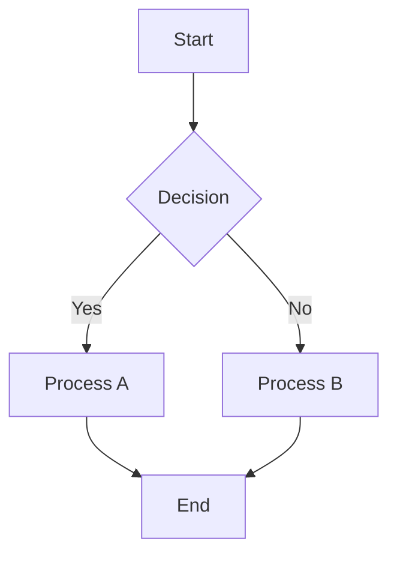
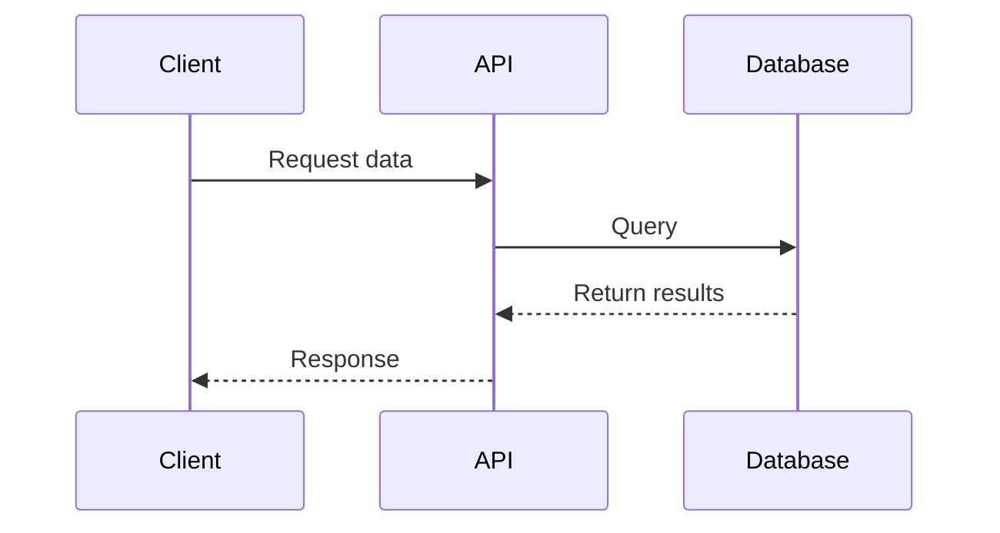
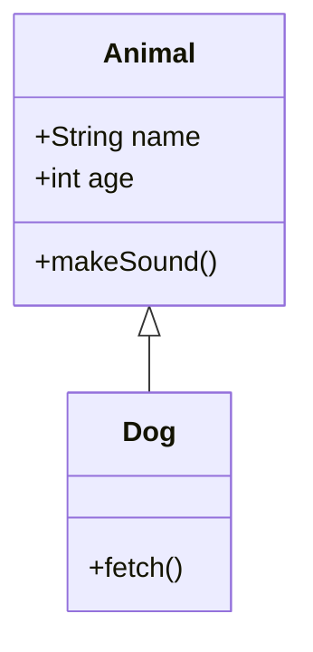
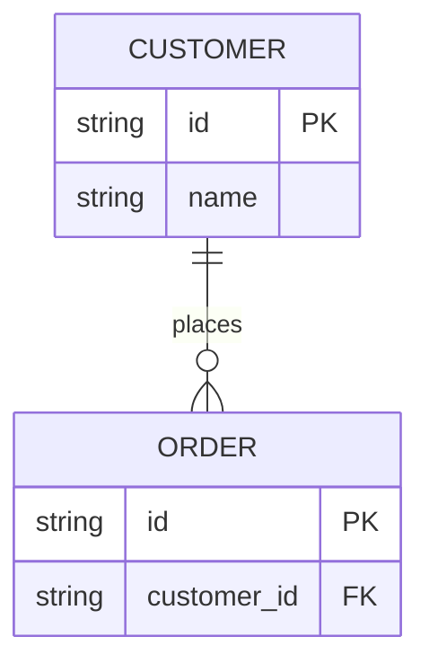

# Mermaid Diagram Style Guide

This document outlines standards for creating diagrams using Mermaid syntax in
documentation and specifications.

## When to use Mermaid

Use Mermaid diagrams for:

- Architecture diagrams.
- Flowcharts and decision trees.
- Sequence diagrams.
- Class diagrams.
- ER diagrams.
- Gantt charts.
- State diagrams.

## Diagram types

### Flowcharts

Use for process visualization and decision trees.

### Sequence diagrams

Use for showing interactions between actors or components over time.

### Class diagrams

Use for object-oriented design documentation.

### ER diagrams

Use for database schema documentation.

