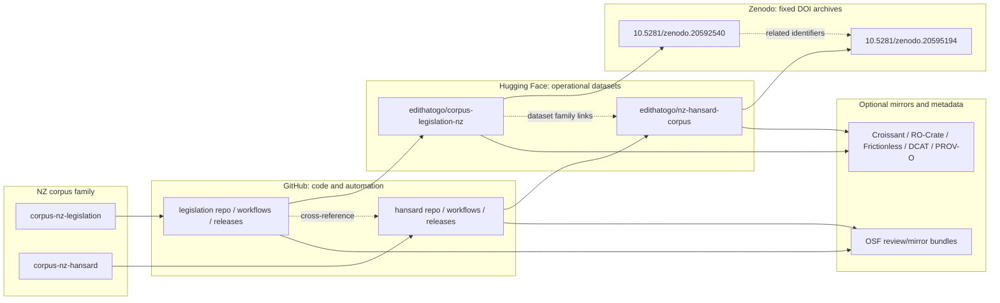
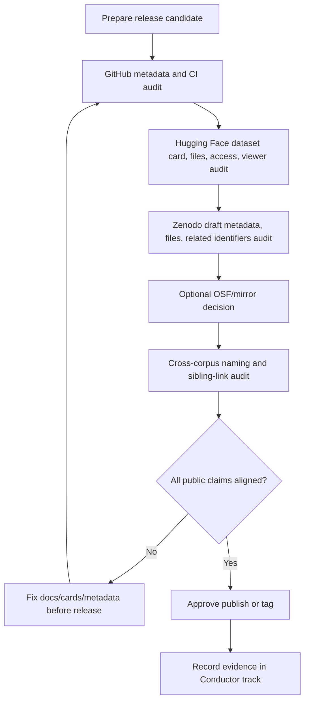
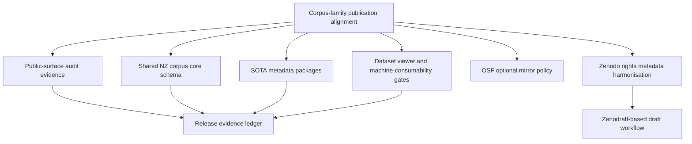

# Corpus Family Alignment Design

## Design Principle

`corpus-nz-legislation` and `corpus-nz-hansard` should operate as sibling projects in a systematic New Zealand public-text corpus family. They may have different source systems and schemas, but they should share naming conventions, publication-surface rules, validation gates, and release evidence patterns.

## Preferred Names

| Corpus | Preferred project label | Current/local or published names observed | Naming action |
| --- | --- | --- | --- |
| Legislation | `corpus-nz-legislation` | local `corpus-law-nz`; GitHub `corpus-legislation-nz`; package `corpus-legislation-nz` | Track migration/reservation without breaking citations. |
| Hansard | `corpus-nz-hansard` | local/GitHub `corpus-nz-hansard`; HF `nz-hansard-corpus` | Keep, and align metadata references. |

## Publication Surface Model

## Environment Alignment Matrix

| Environment | Shared role | Legislation requirement | Hansard requirement |
| --- | --- | --- | --- |
| GitHub | Code, tests, CI, releases, docs, lightweight packages | Prefer future label `corpus-nz-legislation`; keep current published repo stable until migration plan. | Continue `corpus-nz-hansard`; add engineering alignment with legislation baseline. |
| Hugging Face | Dataset hosting, Parquet, cards, Xet storage | Keep `edithatogo/corpus-legislation-nz`; verify access/gating and viewer layout. | Keep `edithatogo/nz-hansard-corpus`; fix viewer split/layout issue and verify ungated access. |
| Zenodo | Fixed DOI archives | Keep published DOI; align related identifiers to GitHub and HF; license must not overclaim source rights. | Keep latest DOI; mark older review DOI as superseded; align license/source-rights wording. |
| OSF | Optional review or mirror | Do not require until file-size/splitting and citation policy are documented. | Same; use only for review bundles or mirrors if explicitly approved. |
| Future metadata registries | SOTA discovery and interoperability | Add Croissant/RO-Crate/Frictionless/DCAT/PROV-O as generated metadata artifacts. | Same; can use Hansard interoperability tracks as baseline. |

## Release Gate Diagram

Current legislation public-surface evidence is recorded in
`docs/public_surface_evidence_ledger.md`.

Track 24's naming/publication decision is recorded in
`docs/naming_publication_alignment.md`.

Track 25's Hansard interoperability mapping is recorded in
`docs/cross_corpus_interoperability_hansard.md`. It adopts reusable Hansard
patterns for DuckDB/search/RAG, endpoint contracts, linked data, generated
metadata packages, validation manifests, and optional publication surfaces while
keeping Hansard-specific parliamentary proceedings fields out of the legislation
core schema.

## Design Notes

- GitHub is the automation and documentation controller, not the large-data host.
- Hugging Face is the browsable/operational dataset host and should remain ungated unless a deliberate access policy says otherwise.
- Zenodo records should be immutable citation snapshots and should link both GitHub and Hugging Face where possible.
- OSF is useful only if it adds review, institutional, or redundancy value without creating another unsynchronised source of truth.
- Every public surface should expose the same preferred naming family and sibling-corpus links.
- Derived interoperability artifacts should be generated, versioned, validated,
  checksummed, and optional. They must not expand the base runtime dependency
  set or replace dataset-specific core schemas without a separate implementation
  track.

## Recommended Additional Tracks

### Zenodraft integration design

Future Zenodo automation should prefer `zenodraft` (`https://github.com/zenodraft/zenodraft`) for draft deposition operations. The design target is:

1. Generate archive files and `.zenodo.json` metadata locally.
2. Run `zenodraft metadata validate .zenodo.json` before upload.
3. Use `zenodraft deposition create concept` or `zenodraft deposition create version <concept_id>` for draft creation.
4. Use `zenodraft file add` and `zenodraft metadata update` for draft contents.
5. Use `zenodraft deposition show prereserved` and `show details` to capture evidence.
6. Keep `zenodraft deposition publish` in a separate protected approval step.

CI must map repository secrets to `ZENODO_ACCESS_TOKEN` or `ZENODO_SANDBOX_ACCESS_TOKEN` only for the step that needs them.

Track 27's rights and zenodraft evaluation decision is recorded in
`docs/zenodo_rights_metadata_zenodraft.md`.

Track 28's GitHub repository-name migration assessment is recorded in
`docs/github_repository_name_migration_assessment.md`. It recommends reserving
`edithatogo/corpus-nz-legislation` as a pointer repository before any full live
rename of `edithatogo/corpus-legislation-nz`.

Track 29's shared core schema is recorded in
`docs/shared_nz_corpus_core_schema.md` and
`schemas/shared_nz_corpus_core.schema.json`.

Track 30's generated metadata package contract is recorded in
`docs/sota_metadata_packages.md`.
